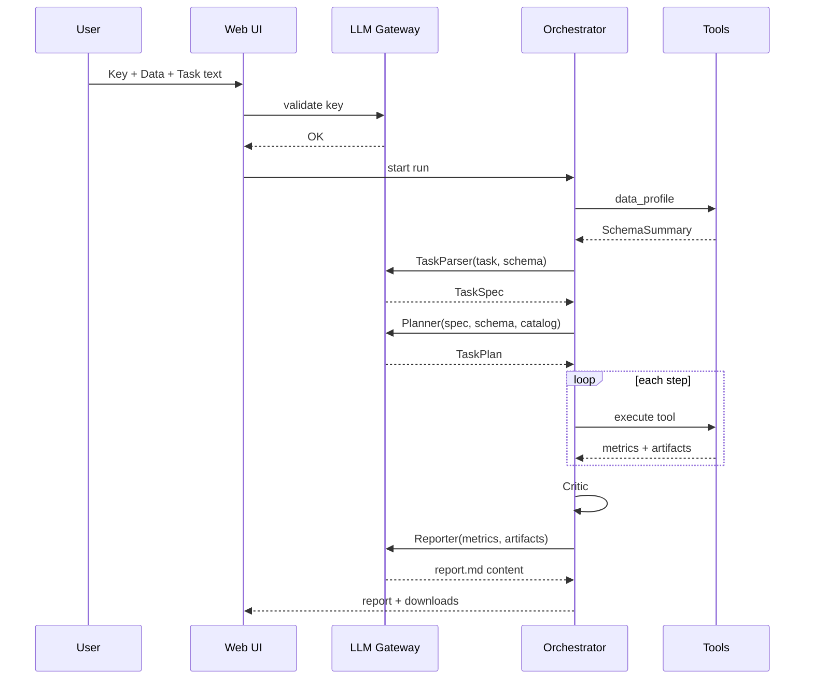

# 大众点评数据分析 AI Agent — 技术架构（LLM 驱动版）

> 产品计划见 [`plan.md`](./plan.md)。  
> **硬约束：必须配置 API 密钥；TaskParser / Planner / Reporter 走 LLM；Tool 层保持确定性。**

---

## 1. 架构原则

| 原则 | 说明 |
|------|------|
| **LLM-first** | 任务理解、步骤规划、报告撰写必须由 LLM 完成 |
| **Key-required** | 启动前校验密钥；无密钥则 Fail-fast |
| **Tool-grounded** | 所有数值、表格、模型指标来自 Tool，LLM 只解读 |
| **No hallucination** | Critic 校验报告数字 ⊆ `metrics.json` |
| **OpenAI-compatible** | 统一 Gateway，支持多家 API / 本地代理 |
| **任务驱动** | 输入 = 数据集 + 自然语言任务（不按周编排） |

---

## 2. 系统全景

```
                         ┌─────────────────────────┐
                         │   Web UI / CLI          │
                         │  Key + Data + Task      │
                         └───────────┬─────────────┘
                                     │
                         ┌───────────▼─────────────┐
                         │   Auth Gate             │
                         │  API Key 存在且可用？    │
                         └───┬─────────────┬───────┘
                      No     │             │ Yes
                      ▼      │             ▼
                   [拒绝启动] │    ┌─────────────────┐
                             │    │  Entry Layer    │
                             │    │  Config · Data  │
                             │    └────────┬────────┘
                             │             │
                             │    ┌────────▼────────┐
                             │    │ data_profile    │  ← 本地 Tool
                             │    └────────┬────────┘
                             │             │ SchemaSummary
                             │    ┌────────▼────────┐
                             │    │ LLM TaskParser  │
                             │    └────────┬────────┘
                             │             │ TaskSpec
                             │    ┌────────▼────────┐
                             │    │ LLM Planner     │
                             │    └────────┬────────┘
                             │             │ TaskPlan DAG
                             │    ┌────────▼────────┐
                             │    │ Orchestrator    │
                             │    │ + Executor      │
                             │    └────────┬────────┘
                             │             │ metrics, artifacts
                             │    ┌────────▼────────┐
                             │    │ Critic          │
                             │    └────────┬────────┘
                             │             │
                             │    ┌────────▼────────┐
                             │    │ LLM Reporter    │
                             │    └────────┬────────┘
                             │             ▼
                             │         report.md
                             │
                             └──── LLM Gateway ◀────┘
                                   (所有 LLM 调用)
```

---

## 3. 密钥与鉴权架构

### 3.1 密钥来源优先级

```
UI session（password 输入，不落盘）
    ↓ 覆盖
环境变量 DEEPSEEK_API_KEY
    ↓ 覆盖
.env 文件
    ↓ 覆盖
config llm.api_key（不推荐）
```

### 3.2 Auth Gate（启动门禁）

```python
class AuthGate:
    def validate(self) -> AuthResult:
        # 1. 密钥非空
        # 2. 格式基本合法（非占位符）
        # 3. 可选：轻量 API ping（list models / 最小 completion）
```

| 入口 | 行为 |
|------|------|
| UI「开始分析」 | 无 key → 按钮禁用 + 提示 |
| CLI `run` | 无 key → exit 1 + 说明 |
| `setup-check` | 报告 key 是否配置、API 是否可达 |

### 3.3 安全

- 密钥 **never** 写入：`state.json`、`report.md`、`run.log`、`llm_calls.json`
- 日志中对 key 做 `sk-****` 脱敏
- `.gitignore` 包含 `.env`
- UI 使用 `st.text_input(type="password")`

---

## 4. LLM Gateway（核心基础设施）

### 4.1 职责

| 职责 | 说明 |
|------|------|
| 统一客户端 | OpenAI SDK 或 httpx 调兼容接口 |
| 结构化输出 | JSON mode / function calling / 解析 retry |
| 重试 | 429/5xx 指数退避 |
| 审计 | 记录 model、tokens、latency（无 prompt 全量可选） |
| 注入 | 从 Auth Gate 取 key，不散落各模块 |

### 4.2 接口草案

```python
class LLMGateway:
    def __init__(self, config: dict, api_key: str): ...

    def chat(self, messages: list[dict], **kwargs) -> str: ...

    def chat_json(
        self,
        messages: list[dict],
        schema: dict | type[BaseModel],
        **kwargs,
    ) -> dict: ...
```

### 4.3 配置

```yaml
llm:
  required: true
  provider: deepseek
  base_url: ${DEEPSEEK_BASE_URL:-https://api.deepseek.com/v1}
  model: ${DEEPSEEK_MODEL:-deepseek-chat}
  model: gpt-4o-mini
  temperature: 0.2
  max_tokens: 4096
  timeout_sec: 60
  max_retries: 2
  json_mode: true
```

---

## 5. LLM 模块设计

### 5.1 TaskParser（LLM）

**输入：**

- 用户自然语言任务
- `SchemaSummary`（列名、类型、行数、映射、样例 3 行）

**输出：** `TaskSpec` JSON

```json
{
  "goal": "...",
  "deliverables": ["clean_data", "report", "figures"],
  "acceptance": {"need_clean_data": true},
  "params": {"positive_threshold": 4},
  "assumptions": ["好评定义为 score>=4"],
  "clarifications": []
}
```

**Prompt 约束：**

- 不假设不存在的字段
- 歧义时填 `clarifications`，Orchestrator 可暂停追问

### 5.2 Planner（LLM）

**输入：**

- `TaskSpec`
- `SchemaSummary`
- `ToolCatalog`（tool 名、描述、required_columns）

**输出：** `TaskPlan` JSON（步骤 DAG）

**约束：**

- `tool` 必须来自 Catalog
- 不得编造路径
- `feasibility`: feasible | partial | infeasible
- partial/infeasible 必须写 `notes`

**与规则 Planner 关系：**

- **主路径**：LLM Planner
- **降级**（可选）：LLM 连续失败 → 规则 Planner + 报告顶部声明「降级模式」

### 5.3 Reporter（LLM）

**输入：**

- `TaskSpec.goal`
- `metrics.json`
- 图表清单（title + 相对路径）
- 清洗数据摘要（行数 + 前 5 行 markdown 表）
- 关键词 TopK（若有）

**输出：** Markdown 字符串 → `report.md`

**Prompt 铁律：**

```
- 每个数字必须来自 metrics 或摘要表
- 不得编造样本量、均值、占比
- 不确定时写「数据未提供」
- 用中文撰写，结构清晰
```

**后处理：**

- 嵌入 ``
- 附 `clean_data.csv` 链接说明（若存在）

### 5.4 Critic（规则 + LLM）

| 检查 | 方式 |
|------|------|
| 产出文件存在 | 规则 |
| metrics 阈值 | 规则 |
| 报告数字 ⊆ metrics | 规则（正则提取数字比对）或 LLM 辅助 |
| 叙述是否偏离任务 | LLM 轻量评分（可选） |

---

## 6. Tool 层（不变：确定性执行）

LLM **不**进入 Tool 内部。

```python
class BaseTool(ABC):
    name: str
    description: str          # 供 LLM Planner 阅读
    required_columns: list[str]

    def run(self, ctx: RunContext, **kwargs) -> ToolResult: ...
```

### Tool Catalog（供 LLM 选型）

注册表示例：

```yaml
- name: clean_table
  description: 去重、缺失与异常值清洗
  required_columns_any: [score, content, shop_id]
  outputs: [clean_data, clean_csv]

- name: llm_render_report
  description: 基于 metrics 由 LLM 生成 Markdown 报告
  depends_on: [metrics.json]
```

### 新增 Tool：`llm_render_report`

- 收集 artifacts + metrics
- 调 LLM Reporter
- 写 `report.md` + 复制 assets 到 bundle 目录
- 替代当前纯模板 `render_report`

---

## 7. 编排与状态

### 7.1 状态机

```
INIT
  → AUTH_CHECK ──(fail)──▶ BLOCKED
  → PROFILE (local)
  → LLM_PARSE_TASK
  → LLM_PLAN
  → FEASIBILITY
  → EXECUTE (tools loop)
  → CRITIC
  → LLM_REPORT
  → DONE | FAILED
```

### 7.2 AgentState 扩展

```json
{
  "run_id": "...",
  "task_id": "...",
  "llm_model": "gpt-4o-mini",
  "llm_usage": {"prompt_tokens": 1200, "completion_tokens": 800},
  "plan_source": "llm",
  "report_source": "llm",
  "current_step": "llm_report",
  "status": "EXECUTE"
}
```

### 7.3 进度回调（UI）

| 阶段 | 进度区间 | 文案示例 |
|------|----------|----------|
| AUTH | 0–2% | 校验 API 密钥 |
| PROFILE | 2–8% | 探查数据结构 |
| LLM_PARSE | 8–15% | LLM 理解任务要求 |
| LLM_PLAN | 15–22% | LLM 规划分析步骤 |
| EXECUTE | 22–90% | 正在执行：数据清洗（3/8） |
| CRITIC | 90–95% | 验收分析结果 |
| LLM_REPORT | 95–99% | LLM 撰写报告 |
| DONE | 100% | 分析完成 |

---

## 8. 数据流



---

## 9. 入口层

### 9.1 Web UI

```
┌─────────────────────────────────────┐
│  API 密钥  [password input]          │
│  数据集    [file uploader]           │
│  任务要求  [textarea]                │
│  [开始分析]  ← 无 key 时 disabled     │
│  ████████░░  正在执行：数据清洗 3/8   │
│  ─────────────────────────────────  │
│  # 分析报告（LLM 生成）              │
│  ...                                │
│  [下载 Markdown] [下载清洗数据]      │
└─────────────────────────────────────┘
```

### 9.2 CLI

```bash
python -m src.cli setup-check          # 含 key 检测
python -m src.cli run --data ... --task "自然语言任务"
python -m src.cli run --data ... --task tasks/x.md --model gpt-4o
```

密钥默认从环境变量读取；CLI 不提供 `--api-key` 参数（避免 shell history 泄露）。

---

## 10. 目录结构（目标）

```
src/
├── agent/
│   ├── auth_gate.py           # 密钥校验
│   ├── task_parser.py         # LLM
│   ├── planner.py             # LLM（主）+ rule（降级）
│   ├── orchestrator.py
│   ├── run_loop.py
│   └── critic.py
├── infra/
│   ├── llm_gateway.py         # 必实现
│   └── llm_prompts/           # 各阶段 prompt 模板
│       ├── task_parser.md
│       ├── planner.md
│       └── reporter.md
├── tools/
│   ├── registry.py            # Tool Catalog 导出
│   └── report/
│       └── llm_render_report.py
└── ui/
    └── app.py                 # 密钥 + 进度 + 报告
```

---

## 11. Prompt 管理

| 文件 | 用途 |
|------|------|
| `llm_prompts/task_parser.md` | 任务 → TaskSpec |
| `llm_prompts/planner.md` | TaskSpec + schema → TaskPlan |
| `llm_prompts/reporter.md` | metrics → 报告 |
| `llm_prompts/system.md` | 全局：角色、禁编造、中文 |

Prompt 版本写入 `run_meta.json`，便于复现与 A/B。

---

## 12. 可观测性

```
logs/runs/{run_id}/
├── state.json
├── metrics.json
├── plan.json
├── llm_calls.json          # [{stage, model, tokens, latency_ms}]
├── task_spec.json          # LLM 解析结果
├── report.md
└── run.log                 # 无密钥
```

---

## 13. 非功能需求

| 项 | 目标 |
|----|------|
| LLM 延迟 | TaskParser+Planner < 15s；Reporter < 30s（视模型） |
| 成本 | 单次分析 prompt 控制在 ~8k tokens 内（schema 摘要） |
| 可用性 | API 失败重试 2 次；仍失败则明确报错 |
| 复现 | Tool metrics 同 seed 可复现；LLM 报告允许措辞差异 |

---

## 14. 架构决策（ADR）

| 决策 | 选择 | 理由 |
|------|------|------|
| 是否必须 LLM | **是** | 产品要求理解任务 + 写报告 |
| 密钥 | 必填，启动门禁 | 避免「假 Agent」 |
| 计算位置 | Tool 本地 | 可复现、可测试 |
| API 形态 | OpenAI 兼容 | 生态最广 |
| 报告 | LLM 生成 | 自然语言洞察 |
| 规划 | LLM 主路径 | 灵活应对多样任务 |
| 规则 Planner | 仅降级 | 保底，非默认 |

---

## 15. 当前代码 → 目标架构迁移清单

| 模块 | 现状 | 改造 |
|------|------|------|
| `config.yaml` | `llm.enabled: false` | `llm.required: true` |
| `llm_gateway.py` | 空壳 | 实现 chat + chat_json |
| `planner.py` | RulePlanner | LLMPlanner + Catalog |
| `task_builder.py` | 关键词推断 | 改为 LLM TaskParser 或作 fallback |
| `render_report.py` | Jinja 模板 | `llm_render_report` |
| `ui/app.py` | 无密钥 | 增加密钥栏 + Auth Gate |
| `orchestrator.py` | 直接规划 | AUTH → PROFILE → LLM_PARSE → LLM_PLAN |

---

## 16. 与 plan.md 的分工

| 文档 | 内容 |
|------|------|
| `plan.md` | 产品目标、使用方式、阶段排期、风险 |
| `architecture.md` | 模块、接口、密钥、LLM 流程、迁移清单 |

---

## 附录：Tool vs LLM 边界（速查）

```
用户任务 ──▶ LLM 理解
数据长什么样 ──▶ 本地 profile
具体怎么洗、怎么算 ──▶ 本地 Tool
洗完多少行、均值多少 ──▶ Tool → metrics.json
这些数字意味着什么 ──▶ LLM 写报告
```
